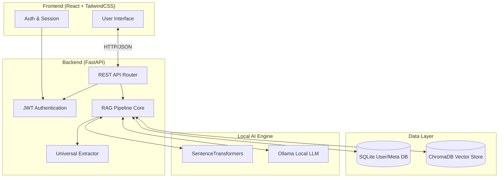

# FinSentinelAI

<div align="center">
  
  
  
</div>

<br>

**FinSentinelAI** is an enterprise-grade, privacy-first AI financial document intelligence platform. It runs 100% locally to process, index, and query highly sensitive financial documents (invoices, receipts, bank statements) using advanced RAG (Retrieval-Augmented Generation) and local LLMs.

---

## Features (v1.0.0)

* **Top 1% Minimalist UI:** Ultra-premium, Apple-inspired React Single Page Application built with Vite and TailwindCSS v3.
* **100% Local & Private:** No API calls to OpenAI or Anthropic. All documents, embeddings, and chat interactions stay completely on your machine.
* **Decoupled Architecture:** High-performance asynchronous FastAPI backend communicating seamlessly with a React frontend via REST APIs.
* **User Isolation:** Secure JWT-based authentication. Every user gets a private workspace.
* **ChromaDB Vector Store:** Blazing fast vector retrieval with native database-level metadata filtering (guarantees cross-user data isolation).
* **Multi-Modal Support:** Automatically extracts text from PDFs, CSVs, JSONs, and images (using local Vision-Language Models).

---

## Architecture Flow

Below is the high-level system architecture of FinSentinelAI:



---

## Getting Started

### Prerequisites
* Python 3.10+
* Node.js v18+ & npm
* [Ollama](https://ollama.ai/) installed and running locally with your model of choice.

### 1. Backend Setup

```powershell
# Clone the repository
git clone https://github.com/Lourdhu02/FinSentinal.AI.git
cd FinSentinal.AI

# Create and activate virtual environment
python -m venv venv
.\venv\Scripts\activate

# Install requirements
pip install -r requirements.txt

# Start the FastAPI Server (runs on http://localhost:8000)
python -m uvicorn api.main:app --host 0.0.0.0 --port 8000
```

### 2. Frontend Setup

Open a new terminal window:

```powershell
# Navigate to the frontend directory
cd frontend

# Install Node dependencies
npm install

# Start the React Dev Server (runs on http://localhost:5173)
npm run dev
```

### 3. Usage

1. Open your browser to `http://localhost:5173`.
2. Click **Create an account** on the login screen.
3. Access your private **Document Dashboard**.
4. Upload financial documents.
5. Navigate to the **Assistant Chat** to securely query your data using local AI.

---

## Security & Privacy
FinSentinelAI enforces strict security boundaries.
* Passwords are irreversibly hashed using `bcrypt`.
* Sessions are stateless and validated via JWT access tokens.
* The vector store natively filters by `user_id`, meaning it is mathematically impossible for the LLM to access or "hallucinate" context from another user's financial documents.

---

## License
MIT License. See `LICENSE` for more information.
